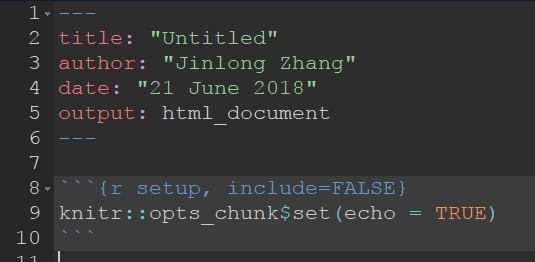
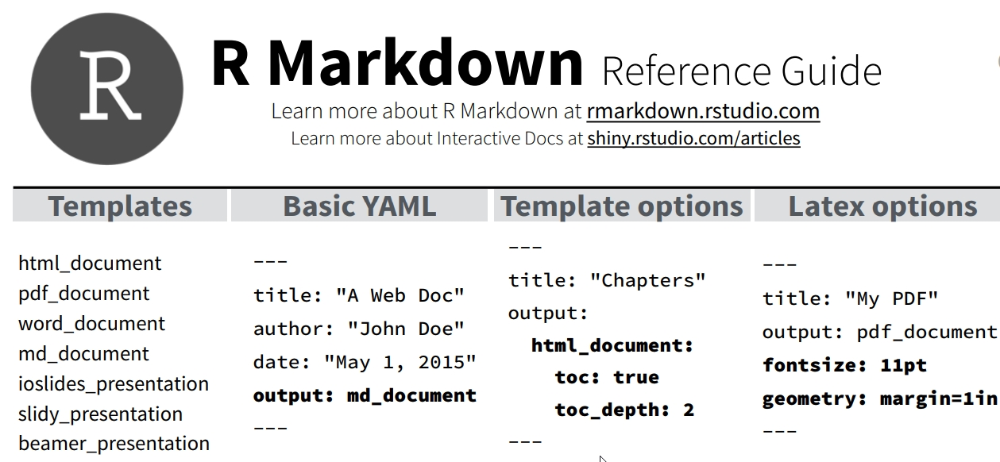

# 什么是R？

## 什么是R？

-   R是一个统计、计算、绘图的环境，可以运行在Windows、
    MacOS、Linux、UNIX等多种操作系统中运行
-   R既可以看作一个软件，也可以看作指运行在这个软件上的计算机语言

## 哪个软件跟R的关系最近？

-   Excel：数据输入与分析

-   SPSS：统计

-   SAS： 统计

-   Matlab：数学建模

-   Origin: 绘图

-   SigmaPlot:绘图

-   Mathematica：数学计算和绘图

-   Maple：数学计算

## 哪个语言跟R的关系最近？

-   Perl：生物信息学分析

-   Python：大数据、人工智能

-   C：计算机语言，编写应用程序

-   Cpp (C++)：计算机语言，编写应用程序

-   Fortran：高性能计算

-   Splus：统计

## R语言是怎么来的？

-   1970年代，美国贝尔实验室的John Chambers， Rick Becker，Trevor
    Hastie，Allan Wilks等人研发了用于统计分析的S语言
-   1988年，有公司开发了Splus商业软件，执行S语言，大受欢迎
-   90年初，新西兰奥克兰大学的Robert Gentleman和Ross
    Ihaka开发了一个软件，用于S语言的教学
-   1995年，两人将该软件开源，并命名为R
-   1997年，R由核心管理开始管理，CRAN上线
-   2000年，R1.0.0版本发布 

目前版本R4.1.0

## 近年来的重要进展

-   2007年，ggplot2上线
-   2011年，Rstudio发布
-   2014年，rmarkdown包发布
-   2016年，tidyverse包发布

# 为什么要学习R？

## 植物学家正在从多个角度"研究"植物

1.  系统分类（描述、命名、分类修订）
2.  编目、保护（红色名录评估）
3.  基因组学 （鉴定、推断系统发育关系）
4.  DNA条形码 （鉴定、推断系统发育关系）
5.  群体遗传学 （推断种群历史以及多种指标）
6.  物种潜在分布区预测
7.  标本数字化 （数据的清洁和标准化）
8.  标本馆管理 （标签、名录更新）
9.  "科普"（微信公众号、博客） 跟普通公众交流

## 植物学研究的一些新变化

1.  数据量巨大（Big data）:

    动辄 几万、几十万条数据，一般难以手动处理

2.  复杂的工作流程 (working flow)

    越来越依靠R、Python、Perl、Ruby等计算机语言，代码本身包括了工作流

3.  可重复性 (Reproducibility)：

    数据收集的方法以及各种细节，保证其他人在看过材料与方法之后，就能将研究重复出来。

    举例：不仅仅要提供软件，还要提供软件的版本和运行该软件的代码

4.  开放科学 open science：

    开放获取文章、开放数据、开放代码、开放审稿意见

## 植物学家需要掌握的工具越来越多

1.  数据分析汇总： Excel、SPSS 或者 SAS
2.  建立进化树，如 BEAST、MEGA、paup\*、MrBayes、RAxML...
3.  绘图软件： sigmaplot、Excel、PhotoShop、Adobe
    Illustrator、Origin、FigTree、Geneious、paint.net、Inkscape
4.  GIS： ArcGIS、QGIS
5.  物种潜在分布区分析: Maxent
6.  系统发育比较分析: Mesquite、PAML...
7.  编写植物名录： Access、MySQL
8.  文献管理：Zotero、Mendeley、Endnote等等

如果能有一个软件，能将上述大部分的工作做了，而且，过程可重复，不好吗？

## 对植物学家来说，R能做什么？

1.  计算器
2.  基本的统计分析（t检验、方差分析、回归）
3.  绘图（各种复杂的图形）
4.  空间信息处理以及地图绘制 （GIS）
5.  做幻灯片、文档
6.  编写植物名录
7.  开发自己的模型、算法
8.  还有上一页软件的几乎所有功能！

# 植物学家真的需要R吗？

## 植物学家真的需要R吗？

-   用R处理植物图库
-   植物分布以及区系分区
-   进化树与系统发育分析
-   人工智能和机器学习（如果真有兴趣......）
-   Rmarkdown与可重复研究

## 用R处理植物信息？

-   批量重命名照片
-   批量移动照片到所在的科、属的文件夹
-   批量提取地理坐标并生成kml文件
-   批量裁剪照片添加水印
-   批量生成物种分布图
-   获取GBIF上的植物标本信息

上述都可通过编写简单的R脚本实现

## 用plantlist包查询科属

1.  批量查询科属：你熟悉APG系统吗？
2.  根据中文名查询学名
3.  根据拉丁名查询中文名和分布
4.  根据拉丁名查询接受状态

## 用plantlist包生成植物名录

根据中文名，查询出学名，分布地点，并按照科属顺序排列

``` {.r}
library(plantlist)
make_checklist(
  checklist_dat = CTPL(
     c("狼毒","粗叶卷柏",
       "侧金盏花","土沉香")), 
  outfile = "output_make_checklist.md",
  theme = "minimal")
```

## 用plantlist包生成植物名录


## 用herblabel包生成标本标签


## 用herblabel包生成标本标签


## 用herblabel包生成标本标签


## 植物分布以及区系分区


## 绘制地图 (sf + ggplot2 + tmap + raster + rgdal + spatial)


## 植物区系分区


## 物种潜在分布区预测

%20in%20R.jpg)

## 绘制进化树


## 重建祖先性状 ape


## 进化树与其他信息组合 ggtree


## 祖先分布区推断 biogeobears


## 关键性状进化速率


# 植物学家怎么学习R？

## 怎么学习R？

植物学家：如果没有很好的数学和计算机基础，能学好吗？

**答： 可以**

1.  搭建好R的运行环境
2.  参加培训班或者看看R的学习视频
3.  理解数据的读入和R中数据的类型以及操作的方法
4.  练习、练习、练习

# R数据分析平台的搭建（技术性很强）

## R语言平台的搭建

安装以下软件

1.  R软件：运行R语言
2.  Rtools：Windows编译R程序包的软件
3.  Rstudio：R的集成开发环境
4.  tinytex：texlive的子集，用于编译pdf等
5.  git：控制版本
6.  vscode：编写文本

## 安装R软件


## 安装R


## 将R添加到系统路径


## 将R添加到系统路径


## 将R添加到系统路径


## 将R添加到系统路径


## 将R添加到系统路径

.jpg)

## 安装开发工具Rtools （编译程序包）


## 安装Rtools


## 将Rtools添加到系统路径


## 将Rtools添加到系统路径 （安装成功了吗？）


## 安装开发工具tinytex （编译文档）


## 安装tinytex


## 怎样知道成功安装了tinytex？


## 版本控制软件git


## git安装成功了么？


## git安装成功了！


# R基础

## 认识R的界面 （主要用在Rstudio出现以前）

.jpg)

## Rstudio的界面


## Rstudio常用的选项 （页面布局）


## Rstudio常用的选项 Tools


## Rstudio常用的选项 保存和读取UTF8编码的文本文件


## Rstudio常用的选项 （改变主题和字体）


## 文本编辑器VScode


# R程序包

## 什么是R程序包？

-   R程序包是包含R函数、文档、数据以及相应说明的一个文件夹或者编译好的压缩文件。

-   一个程序包在R环境内执行一个或者多个特定的功能。

## R的功能靠程序包实现

-   **base系列程序包**：R的基础程序包，可以实现基本的统计、绘图、文字处理、文件操作等
-   **tidyverse系列程序包**：主要用于数据科学
-   **某一领域专用的系列程序包**：如系统发育分析、生物多样性分析、空间分析绘图等

## 一些常用的程序包

1.  ape：系统发育与进化分析
2.  tidyverse：包括ggplot2、purrr、 tibble、 dplyr、 tidyr 、
    stringr、readr、 forcats等，主要用于数据科学
3.  sf+ggplot2+tmap：空间数据的读取、分析以及绘图
4.  ggtree：绘制进化树

## 一些常用的程序包

8.  knitr +
    rmarkdown：编译markdown文档，生成word、html、pdf、powerpoint等
9.  testthat、devtools、remotes： R程序包的安装和测试
10. dismo、ENMeval、wallace：物种潜在分布区分析
11. meta analysis：荟萃分析
12. shiny：制作动态网页
13. Rsqlite + dbplyr：操作数据库
14. plantlist： 查询科属和生成植物名录
15. herblabel：生成植物标本标签

## 在哪里找程序包？

1.  CRAN：各种类别，参考CRAN task views，用install.pacakges()安装
2.  Bioconductor：主要是基因组学和生物信息学工具
3.  github：多为开发阶段的程序包，用devtools安装
4.  Rforge：多为开发阶段的程序包，现在已不太活跃

## CRAN R镜像网络


## 清华大学R镜像


## Bioconductor


## github

.jpg)

## 安装CRAN上的程序包

``` {.r}
install.packages("ape") 
# 安装一个

install.packages("tidyverse", 
    dependencies = TRUE) 
# 安装一系列，并安装所有依赖的程序包
```

## 安装Github上的程序包

从源代码安装github上的phylotools包

``` {.r}
library(devtools)
install_github("helixcn/phylotools",
    build_vignettes = TRUE)
```

如果还没有安装devtools，则输入

``` {.r}
install.packages("devtools")
```

## 安装Bioconductor上的程序包

``` {.r}
if (!requireNamespace("BiocManager", 
    quietly = TRUE))
    install.packages("BiocManager")

BiocManager::install("ggtree")
```

## 安装CRAN上的一类程序包

安装CRAN上某一领域（如Phylogenetics）的相应程序包

``` {.r}
library(ctv)
install.views("Phylogenetics")
```

## 植物学研究一般参考Phylogenetics和Environmetrics


## CRAN Task View: Phylogenetics


## 有多少程序包？

 
截至今天 2021-07-10

## CRAN提供的R程序包的页面


## CRAN提供的R程序包的页面：以picante包为例


## R程序包的内部结构


## C语言的代码放在src文件夹里


## Description文件的内容


## 加载程序包


# R的对象及基本操作

## 运行代码的方式

-   贴入 R console运行 （原始社会？）
-   在Rstudio的Console运行
-   在Rstudio的Source窗口运行
-   用CMD中Rscript运行

## 运行代码的方式


## 在Rstudio新建R脚本


## 运行R脚本


## R脚本举例


## 完整R脚本包含的内容

1.  说明此脚本的目的、作者以及日期、版本等
2.  设定工作目录 `setwd()`
3.  加载程序包 `library()`
4.  读取数据 `read.csv()`
5.  数据处理 `lm`, `glm`...
6.  建立模型
7.  绘图 `plot`
8.  保存数据 `write.csv`, `save.image()`

# R中的对象及其基本操作

## R中的对象

R中一切都是对象 (Object)

但是这些对象有一些类似的结构: -
有些类似Excel表格的数据（数据框：data.frame） -
有些类似表格的一列（向量：vector）
-有些则将多种数据类型整合到一起（列表list）。

对数据操作的代码，如果有一个简单的名字可以调用，就称为函数function。

而所有上述的数据，都是由一些基本的元素组成的（类似Excel的一个单元格）

## R中对象的命名

R中的对象最好用英文字母开头，不能用数字开头。

## 四则运算

-   +:加
-   -:减
-   \*:乘
-   /:除

```{R}
(2+5)*(15-4.1)
```

## 赋值

-   尽量使用 `<-`
-   设定参数时 `=`
-   不要用 `->`
-   管道符号 `|>`

*赋值符号左右均应留一个空格*

## 元素的类型

-   **数值型 `Numeric`:** 用户不必区分整数和小数， R会自动判断，如 12,
    5000, 3.1415926
-   **字符串型`Character`:** 如 `"Guangzhou"`
-   **因子型`Factor`:** 如
    某种实验处理，增加光照，不增加光照，就属于因子类型
-   **逻辑型`Logical`:** 如 导师是否同意报销午餐， 是`TRUE`或否`FALSE`
-   **复数型`Complex`:** 较少用到

## 其他类型 NaN, NA, NULL

-   `NA`: 缺失值
-   `NULL`: 不存在
-   `NaN`: Not a number 非数值
-   `Inf`: 正无穷

## 基本数据类型

以上基本元素按照一定规律组合，就构成了R中的基本数据类型:

-   **向量`vector`:**
    元素按照一定顺序组合，就构成了向量。注意，单独一个元素也是向量。
-   **矩阵`matrix`:**同一种类型数据按照行和列排列。
-   **数组`array`:**
    同一种类型数据，按照二维或者多个维度排列，在R中较少用到。
-   **数据框`data.frame`:**
    当多个类型不同，但是长度相同的向量按照列合并，类似于常见的数据记录表。
-   **列表`list`:**
    向量、矩阵、数据框均可放入列表（list）中。列表中也可以放列表。

## 向量的基本操作

向量中的元素必须是相同类型的，如果不相同，
一般会自动转换为字符串类型或者逻辑型。

-   `c()`: 生成向量，合并向量
-   `length()`: 向量的元素个数，或称为长度。
-   `paste()`:合并字符串向量
-   `rep()`: 某一个或者几个元素重复指定的次数

```{R}
aaa <- c("a", "b", "c", 1)
length(aaa)
paste(aaa, collapse = "-")
rep(aaa, c(1,2,1,3))
```

## 矩阵matrix与数组array

定义matrix有两种方式

-   `dim()` 查看matrix的行列数， 也可以用来给向量指定行列，生成matrix

-   `matrix()` 生成matrix

```{R}
test <- 1:20
dim(test) <- c(4, 5)
```

## 查看行列

-   `nrow()` 查看行数
-   `ncol()` 查看列数

```{R}
dim(test)
nrow(test)
ncol(test)
```

## 数据框 data.frame

`data.frame()`: 生成数据框

`cbind()`: 将某一向量添加到现有的数据框中

```{R}
library(vegan)
data(dune.env)
# head(dune.env, 5)
```

## 数据框 data.frame

```{R}
head(dune.env, 5)
```

## 查看data.frame的属性

-   `nrow()` 查看行数
-   `ncol()` 查看列数
-   `rownames()` 行名
-   `colnames()` 列名 提取某一列， 用`$`加列名即可

在数据框中，各列的长度必须相等

```{R}
dim(dune.env)
colnames(dune.env)
dune.env$Moisture # 提取Moisture这一列
```

## list 列表

列表中，使用`$`提取某一个已经命名的组件， 列表中的组件可以是
向量、矩阵、数组、数据框以及列表的任意一种。

```{R}
library(vegan)
data(dune.env)
list(dune.env$A1, dune.env$Use)
```

## 列表内元素的命名

```{R}
list(A1 = dune.env$A1, Use = dune.env$Use)
```

## 下标index与索引indexing

下标是一个向量，用来提取基本数据类型中的某一些符合条件的值。

-   对于vector, 使用`[]`
-   对于matrix, 使用`[,]`
-   对于data.frame,使用`[,]`
-   对于list， 使用`[[]]`

## 下标index与索引indexing (II)

可以放置整数型或者逻辑型两种向量:

1\. 放置`1，2，3，4`等，表示要提取元素的位置 2. 放置`TRUE`，
`FALSE`等，表示是否提取对应的元素

```{R}
letters[1:6]
ind <- letters %in% c("a", "c", "f")
letters[ind]
```

## 比较/判断

比较数值的大小，结果均为逻辑向量

-   `==` 判断数值是否相等， 是为`TRUE`, 否为`FALSE`

```{R}
3 == 5
```

-   `>`: 判断左侧值是否大于右侧值
-   `<`: 判断左侧值是否小于右侧值
-   `>=` :判断左侧值是否大于或等于右侧值
-   `<=` :判断左侧值是否小于或等于右侧值
-   `!=` : 判断左侧值是否不等于右侧值

## 逻辑运算

-   `!`:取反

    -   `!TRUE` 结果为`FALSE`
    -   `!FALSE` 结果为`TRUE`

-   `&`:与,表示同时发生

    -   `TRUE & TRUE` 结果为`TRUE`
    -   `TRUE & FALSE` 结果为`FALSE`
    -   `FALSE & FALSE` 结果为`FALSE`

-   `|`:或

    -   `TRUE|TRUE`结果为`TRUE`
    -   `TRUE|FALSE`结果为`TRUE`
    -   `FALSE|FALSE` 结果为`FALSE`

## 提取部分数据

使用下标，或者subset函数

```{R}
library(vegan)
data(dune.env)
subset(dune.env, Use == "Haypastu")[1:3,]
dune.env[dune.env$A1 > 6,]
dune.env[dune.env$A1 > 3 & dune.env$Use == "Haypastu",]
```

## 数据类型判断 `is.xxx`

返回结果为 `TRUE`或者`FALSE`

``` {.r}
apropos("is\\.")
is.character() # 是否为字符串？
is.data.frame() # 是否为data.frame？
is.matrix() # 是否为矩阵？
is.vector() # 是否为向量？
is.list() # 是否为列表？
is.logical() # 是否为逻辑类型？
```

## 类型转换 `as.xxx`

``` {.r}
apropos("as\\.")
as.character()  # 转换为字符串
as.data.frame() # 转换为data.frame
as.matrix() # 转换为matrix
as.vector() # 转换为vector
as.list() # 转换为list
as.logical() # 转换为逻辑类型
```

# Tidyverse支持者对此强烈反对

## Tidyverse 是什么？


## Tidyverse的数据科学工作流程


## ggplot2绘图

``` {.r}
library(ggplot2)
ggplot(data = mpg, aes(x = cty, y = hwy)) + ### 设置x, y以及数据
    geom_point(aes(color = cyl)) +          ### 添加 点， 以及 设置 点 的颜色
    geom_smooth(method = "lm") +            ### 添加拟合曲线/曲线以及置信区间
    coord_cartesian() +                     ### 笛卡尔坐标系， 即平面直角坐标系
    scale_color_gradient() +                ### 图例的颜色
    scale_shape(solid = FALSE) +            ### 点的类型为中空。
    ggtitle("New Plot Title") +             ### 标题
    xlab("New X label") +                   ### 横轴
    ylab("New Y label")                     ### 纵轴
```

## ggplot2绘图

```{R echo=FALSE}
library(ggplot2)
ggplot(data = mpg, aes(x = cty, y = hwy)) + ### 设置x, y以及数据
    geom_point(aes(color = cyl)) +          ### 添加 点， 以及 设置 点 的颜色
    geom_smooth(method = "lm") +            ### 添加拟合曲线/曲线以及置信区间
    coord_cartesian() +                     ### 笛卡尔坐标系， 即平面直角坐标系
    scale_color_gradient() +                ### 图例的颜色
    scale_shape(solid = FALSE) +            ### 点的类型为中空。
    ggtitle("New Plot Title") +             ### 标题
    xlab("New X label") +                   ### 横轴
    ylab("New Y label")                     ### 纵轴
```


## dplyr转换为tibble

```{R}
dplyr::tbl_df(iris)
```

## dplyr 选取部分数据

```{R}
dplyr::filter(iris, Sepal.Length > 7) 
```

## dplyr 去重复

```{R}
dplyr::distinct(iris)
```

## R 是一种向量化的语言，要尽量避免循环

-   很慢
-   不容易掌握

## apply家族？For循环？下标？

Tidyverser说：打住！

交给tidyverse处理吧！

# Markdown、RMarkdown与可重复研究

## Markdown是什么？

Markdown是一种简单的标记语言。R
markdown是嵌入了R代码的markdown语言，可以转换为多种格式。

## 为什么要发明Markdown？ 

Markdown文档用纯文本书写，通过精心设计的简单字符标记，就能标出文档格式要素。

Markdown由John
Gruber设计出来以后，很快受到程序员、科学家、作家的欢迎。与Markdown相关的软件与文档也迅速增加。

参考： \* <https://markdown-zh.readthedocs.io/en/latest/> \*
<http://wowubuntu.com/markdown/>

## Markdown能干什么？

1.  可重复性研究 Reproducible research

-   <https://cran.r-project.org/web/views/ReproducibleResearch.html>
-   <https://ropensci.org/>

2.  编写R程序包的使用指南。R Markdown是编写Vignettes的首选。

3.  分享文档 <https://rpubs.com/>

4.  制作电子书，博客，个人网站等

-   <https://bookdown.org/>
-   <https://bookdown.org/yihui/blogdown/>

## Markdown 文档中的元素

-   题目：通过YAML文件头设置
-   作者：通过YAML文件头设置
-   标题：\# 一级标题，\#\# 二级标题
-   段落：上下有空行的文字自动成为一段
-   文字引用：每行前面添加\>作为块引用
-   列表：文字之前加 1. ,\* , -， + 即可自动识别为列表
-   代码块：自动高亮
-   水平线：连续三个\*\*\*
-   链接：`[an example](http://example.com/ "Title")`
-   强调：包围在两个`*,_,**,__` 之间，会分别转为斜体或加粗
-   图片：``
-   链接：将网址放入\<\>即可自动转换为链接

## R Markdown文档

R Markdown是Markdown语言的进一步发展，借助knitr和rmarkdown程序包，
整合了R脚本的markdown文档可以很好地编译，并转换为html、pdf、docx等格式。

R
Markdown文档中，嵌入的R代码，称为chunk。花括号中可以设置各种参数，控制R代码是否显示，是否运行，要显示图片的大小等。

{width="60%"}

## R Markdown文档的YAML文件头设定输出格式、作者与样式等

RMarkdown有自己的YAML表头，控制标题，作者，日期，文档编译的方式和类型以及相应参数等。

{width="90%"}


# 植物学家怎么学习R？

## 植物学家怎么学习R？

1.  安装好R，搭建好R的运行环境
2.  理解数据的读入和R中数据的类型以及操作的方法
3.  练习、练习、练习

## 怎么练习？

1.  看入门书籍，明白计算的原理，并将书中的例子都重复出来

2.  跟着视频学习，学什么？视频怎么组织，怎么讲课

3.  阅读函数的说明文档，编写程序包的文档

4.  阅读别人的代码，特别是脚本，熟悉什么情况用什么方法

5.  自己写代码，注意遵循代码编写的规范

## 学习资源

-   github：R生态学学习资源
    <https://github.com/helixcn/awsome-R-ecology-evolution>

-   youtube：R语言编程合集 （英文）

    <https://pan.baidu.com/s/1_wyj1sTeb7wp4cWFwk6Vzw> 提取码：6pfj

-   bioone 视频系列 （<https://www.bio-one.org.cn/>，目前正在准备中）：
    张金龙、胡文浩、崔煜文、李勤、徐洲锋（Python）
    ......期待更多同仁加入

-   ecoinformatics公众号、Y叔的公众号、生信小白鱼的公众号、庄闪闪的R语言手册、R
    learning、R语言与藻类生态学......

-   赖江山博士的博客和培训班


## 结论

1.  R是一个免费开源的数据分析和绘图的环境，也是一种计算机语言
2.  R能做的内容很多，包括了绝大部分现代进化生物学的分析，掌握了R就掌握了海量的科研资源
3.  R的代码能保存工作流程，可让研究更容易重复，这也是当代研究的需要
4.  R简单易学，从今天开始学习R并不晚

## 致谢

-  感谢马老师邀请
-  感谢马老师和李老师组织植物系统学家园微信群作为交流平台
-  感谢各位关注！

# 问题？
